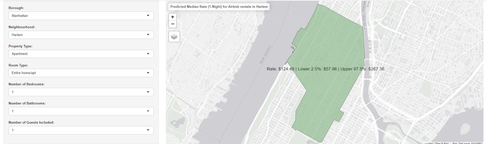
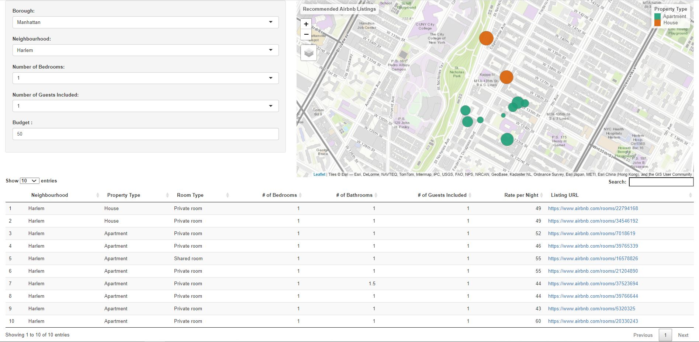

# Decoding Airbnb in The Big Apple
The project focuses on performing analyses on New York City Airbnb and developing business intelligence for both the hosts who are listing their properties and the guests who are using them to meet their accommodation requirements. The tasks also involve deriving insights about the Airbnb’s game changing role in the city’s rental landscape. 
Following are the questions the project tries to answer which are split into three broad sections:
* Insights into Airbnb
	+ How has Airbnb presence grown over the years?
	+ How costly are the Airbnb rates in the neighbourhoods across the five boroughs?  
	+ Does the rental landscape paint the same picture as the real estate setting of NYC?
	+ How badly the Covid-19 crisis affect Airbnb?
* Insights for Hosts
	+ What should be the rental value if you want to list your property with Airbnb?
	+ What are the pain points that a guest finds in Airbnb? 
* Insights for Customers
	+ What are the top 10 listing recommendations based on customer constraints?
## About Data
The complete second-hand dataset is taken from [Inside Airbnb](http://insideairbnb.com/get-the-data.html) which provides non-commercial set of tools and data that allows us to explore how Airbnb is really being used in cities around the world. The New York Airbnb dataset is compiled on 6 May 2020. 
There are three data sets that were used for the analysis, namely –
* `listings.csv` – file contains 106 variables and 50,246 listing information.
* `calendar.csv` – file includes the daily rates of the listings up till a year.
* `reviews.csv` – file includes the reviews of each listing posted by guests.
## Analysis
The complete analysis report is published on [RPubs](https://rpubs.com/phxlumens/nyc_airbnb). 
* [Predict Rate](https://phxlumens.shinyapps.io/predict_rate/): User interface for hosts to suggest them the price at which they can register his/her listing.  

* [Recommend Listings](https://phxlumens.shinyapps.io/recommend_listings/): User interface for customers to view the top 10 suggestions. 

## Get Help
* `code/clean.Rmd` – Run the code file for generating clean datasets (only if new CSVs are downloaded in `download_data` folder)
* `code/run.Rmd` – Run the code file for complete analysis
* `code/predict_rate/app.R` – Shiny App: Predict Rate
* `code/predict_rate/app.R` – Shiny App: Recommend Listings
* `code/report.Rmd` – Knit the code file to generate publishable report
