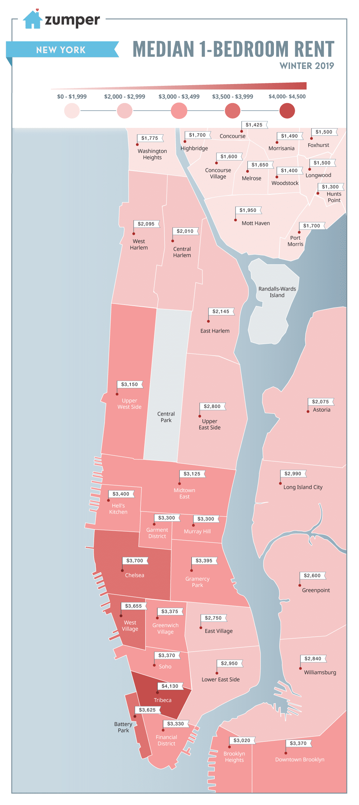
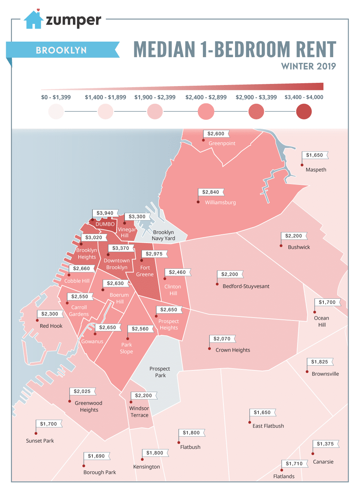

```{r setup, include = FALSE}
knitr::opts_chunk$set(echo = FALSE, warning = FALSE, message = FALSE, 
                      fig.width = 8.25, fig.height = 4, fig.align = 'center')
```

<style>body {text-align: justify}</style>

[Github Repo](https://github.com/krish1919ls/nyc_airbnb){target="_blank"}

## Introduction
Airbnb has been one of the most successful companies since its inception in 2008. According to Airbnb Newsrooms, currently Airbnb has more than 7 million listings in more than 191 countries and regions and operating in more than 100,000 cities. As one of the most popular cities in the world, New York City has been one of the hottest markets for Airbnb. With close to 50,000 listings in the city, Airbnb has interwoven with the rental landscape within 10 years of its inception. Analyses on such a dataset would not only provide intuition about the rental metrics but also shed some light on the socio-economic setting of the city.  
The aim of the project is to perform analyses on New York City Airbnb dataset and uncover insights about the sharing economy in one of the biggest cities of the world. The tasks involve developing business intelligence for both hosts who are listing their apartments and the guests who are using them to meet their accommodation requirements.  
Following are the questions the project tries to answer which are split into three broad sections:

* Insights into Airbnb
	+ How has Airbnb presence grown over the years?
	+ How costly are the Airbnb rates in the neighbourhoods across the five boroughs?  
	+ Does the rental landscape paint the same picture as the real estate setting of NYC?
	+ How badly the Covid-19 crisis affect Airbnb?
* Insights for Hosts
	+ What should be the rental value if you want to list your property with Airbnb?
	+ What are the pain points that a guest finds in Airbnb?
* Insights for Customers
	+ What are the top 10 listing recommendations based on customer constraints?

```{r load libraries and set options}
library(tidyverse)
library(plotly)
library(RColorBrewer)
library(broom)
library(sp)
library(rgdal)
library(sf)
library(tmap)
library(forecast)
library(gains)
library(NLP)
library(sylly)
library(koRpus)
library(koRpus.lang.en)
library(textstem)
library(tm)
library(wordcloud)

theme_set(theme_classic())

tmap_mode('view')
```

## Data Description
The second-hand dataset is taken from Inside Airbnb which provides non-commercial set of tools and data that allows us to explore how Airbnb is really being used in cities around the world. The New York Airbnb dataset is compiled on 6 May 2020. 
There are three data sets that we used for our analysis, namely –

* `listings.csv` – file contains 106 variables and 50,246 listing information. Details about the listings such as price, apartment details, ratings of the apartment, number of rooms, neighbourhood and host information are included in this file. 
* `calendar.csv` – file includes the daily rates of the listings up till a year. The data in the file was used to project the prices during the holiday season. 
* `reviews.csv` – file includes the reviews of each listing posted by guests. This file was primarily used for text analytics.

```{r load data}
listing.df <- read_csv('../data/listings_clean.csv', col_types = cols())
review.df <- read_csv('../data/reviews_clean.csv', col_types = cols())
calendar.df <- read_csv('../data/calendar_clean.csv', col_types = cols())

borough.geo.df <- read_sf('../data/Borough Boundaries.geojson', quiet = TRUE)
borough.geo <- readOGR('../data/Borough Boundaries.geojson', verbose = FALSE)
hood.geo <- readOGR(dsn = '../data/NTA Boundaries.geojson', verbose = FALSE)
```

## Analysis
### How has Airbnb presence grown over the years?

```{r}
listyear.fields <- c('host_since', 'neighbourhood_group_cleansed','property_type','longitude', 'latitude')
listyear.df <- na.omit(listing.df[, listyear.fields])

listyear.df$host_since_year <- format(listyear.df$host_since, '%Y')
listyear.df$property_type <- as.factor(listyear.df$property_type)
listyear.df$longitude <- as.numeric(listyear.df$longitude)
listyear.df$latitude <- as.numeric(listyear.df$latitude)
```

New York City being the most densely populous city in US, has over 50,000 Airbnb listings as of May 2020. Bar plot shows that new listings in NYC increased steadily from 2008 to 2015. Post 2015 new listings started to go down and averaged around 4000 up till last year.

```{r}
data.frame(table(format(listing.df$host_since, '%Y'))) %>%
  plot_ly(type = 'bar', x = ~Var1, y = ~Freq, hoverinfo = 'text', 
          text = ~paste('Year: ', Var1, ', Count: ', Freq)) %>%
  layout(title = 'Barplot: New Listings per Year', 
         xaxis = list(title = 'Year'), 
         yaxis = list(title = '# of Listings'))
```

Geo plot shows the landscape of Airbnb listings over the years. A quick glance at the geo plot reveals that Manhattan and North Brooklyn around the East river are the most populated areas by Airbnb listings.

```{r fig.height = 5.5}
accumulate_by <- function(dat, var) {
  var <- lazyeval::f_eval(var, dat)
  lvls <- plotly:::getLevels(var)
  dats <- lapply(seq_along(lvls), function(x) {
    cbind(dat[var %in% lvls[seq(1, x)], ], frame = lvls[[x]])
  })
  dplyr::bind_rows(dats)
}

ggplotly(ggplot(borough.geo.df) + geom_sf() + ggtitle('Growth of Airbnb in NYC') +
           theme(plot.title = element_text(hjust = 0.5))) %>%
  add_trace(type = 'scatter', mode = 'markers', y = ~latitude, x = ~longitude, frame = ~frame,
            data = listyear.df %>% accumulate_by(~host_since_year),
            marker = list(color = 'firebrick', size = 2), hoverinfo = 'text',
            text = ~property_type, showlegend = F) %>%
  animation_slider(currentvalue = list(prefix = 'Year: ', font = list(color = 'firebrick')))
```

### How costly are the Airbnb rates in the neighbourhoods across the five boroughs?

```{r}
pricehood.fields <- c('neighbourhood_cleansed', 'neighbourhood_group_cleansed', 'price', 'guests_included')
pricehood.df <- na.omit(listing.df[, pricehood.fields])

pricehood.df$neighbourhood_cleansed <- as.factor(pricehood.df$neighbourhood_cleansed)
pricehood.df$neighbourhood_group_cleansed <- as.factor(pricehood.df$neighbourhood_group_cleansed)
pricehood.df$price <- as.numeric(pricehood.df$price)
pricehood.df$guests_included <- as.integer(pricehood.df$guests_included)
```

Since Airbnb rates are not necessarily per individual basis, it made logical sense to standardize the rates with respect to an individual. Also, entities involving price or income generally tend to be right skewed (outliers on the higher end), median is considered to be the best measure of central tendency. To capture the data well, the logarithm of listing price per single guest is taken. The box plots with respect to the five boroughs in NYC illustrates the intuition. Coinciding with intuition of high cost of living in Manhattan, the Airbnb rates are similar to the expectations.  

##### {.tabset .tabset-fade}
###### Rate

```{r}
pricehood.df %>% 
  plot_ly(type = 'box', y = ~round(price/guests_included, 2), color = ~neighbourhood_group_cleansed,
          colors = 'Dark2') %>% 
  layout(title = 'Boxplot: Rate per One Guest w.r.t. Borough', 
         yaxis = list(title = 'Rate per One Guest'),
         showlegend = FALSE)
```

###### Log Rate

```{r}
pricehood.df %>% 
  plot_ly(type = 'box', y = ~round(log(price/guests_included), 2), color = ~neighbourhood_group_cleansed,
          colors = 'Dark2') %>% 
  layout(title = 'Boxplot: Log of Rate per One Guest w.r.t. Borough', 
         yaxis = list(title = 'Log of Rate per One Guest'),
         showlegend = FALSE)
```

##### {-}
To visualize in depth pricing analysis of neighbourhoods in each borough, a heatmap of prices with respect to the neighbourhoods having minimum of 5 listings are plotted. This provides crucial insights on the median price range of neighbourhoods. The grey area in the heat map shows neighbourhood with less than 5 listings. Most of the neighbourhoods in Staten Island have less than 5 listings. The region around East River including North Brooklyn and the entire Manhattan are the costliest places to rent an Airbnb in addition to the most number of listings in the region.

```{r}
medianpricehood.df <- pricehood.df %>% 
  group_by(neighbourhood_group_cleansed, neighbourhood_cleansed) %>% 
  summarise(count = n(), median_price_per_guest = round(median(price/guests_included), 2))

medianpricehood.df[medianpricehood.df$count < 5, ]$median_price_per_guest <- NA

medianpricehood.geo <- hood.geo
medianpricehood.geo@data <- left_join(hood.geo@data, medianpricehood.df, 
                                      by = c('neighbourhood' = 'neighbourhood_cleansed'))

medianpricehood.geo$text <- paste0('Neighbourhood:', medianpricehood.geo$neighbourhood, 
                                   ' | Count:' , medianpricehood.geo$count,
                                   ' | Median Rate per Guest: $', 
                                   medianpricehood.geo$median_price_per_guest)
```

```{r fig.height = 5.5}
tm_shape(medianpricehood.geo) +
  tm_fill(col = 'median_price_per_guest', palette = 'Reds', alpha = 0.7, n = 10,
          title = 'Median Rate per Guest (in $)', id = 'text') +
  tm_borders(col = 'grey60', lwd = 1) + 
  tm_shape(borough.geo) +
  tm_borders(col = 'grey40', lwd = 2) + 
  tm_text(text = 'boro_name', size = 1, col = 'black') +
  tm_layout(title = 'NYC: Rate for 1-Night')
```

### Does the rental landscape paint the same picture as the real estate setting of NYC?
From our previous analysis we found out the following results:

##### {.tabset .tabset-fade}
###### Costliest neighbourhoods in Manhattan with median rate

```{r}
knitr::kable(medianpricehood.df %>% 
  filter(neighbourhood_group_cleansed == 'Manhattan') %>% 
  arrange(desc(median_price_per_guest)) %>% 
  top_n(5, median_price_per_guest),
  col.names = c('Borough', 'Neighbourhood', 'Count', 'Median Price per Guest'))
```

<center>

</center>

###### Costliest neighbourhoods in Brooklyn with median rate

```{r}
knitr::kable(medianpricehood.df %>% 
  filter(neighbourhood_group_cleansed == 'Brooklyn') %>% 
  arrange(desc(median_price_per_guest)) %>% 
  top_n(5, median_price_per_guest),
  col.names = c('Borough', 'Neighbourhood', 'Count', 'Median Price per Guest'))
```

<center>

</center>

##### {-}
Zumper has mapped NYC neighbourhood rents for winter 2019 and the graphs show the Median 1- Bedroom Rents in Brooklyn and Manhattan. Places like Dumbo, Vinegar Hill, Brooklyn Heights, Downtown Brooklyn Fort Greene are costlier neighbourhoods. Similarly places like Tribeca, Battery Park, Soho, West Village and Chelsea in Manhattan are costlier in Manhattan. This presents the real estate setting for the New York boroughs. These places form New York Skyline and is a hub for intercultural and financial activities. Both Zumper and Airbnb paint the same picture.
    
### How badly the Covid-19 crisis affect Airbnb?
##### {.tabset .tabset-fade}
###### Dec 1, 2019 - Jan 1, 2020


###### May 15, 2020 - Jun 15, 2020

```{r}
calendar.df <- calendar.df %>% 
  inner_join(listing.df[, c('id', 'neighbourhood_group_cleansed', 'guests_included')], 
             by = c('listing_id' = 'id')) %>%
  group_by(neighbourhood_group_cleansed, date)
```

```{r}
calendar.df %>%
  summarise(mean_price = round(mean(adjusted_price/guests_included, na.rm = TRUE), 2)) %>%
  plot_ly(type = 'scatter', mode = 'lines', x = ~date, y = ~mean_price,  
          color = ~neighbourhood_group_cleansed, colors = 'Dark2') %>% 
  layout(title = 'Trendplot: Mean Rates per Guest for Various Boroughs
         from May 15, 2020 to Jun 15, 2020', 
         xaxis = list(title = 'Time'),
         yaxis = list(title = 'Mean Price'))
```

##### {-}
From the graphs one can grasp contrasting scenarios. As of September 12, 2019, an average person had to shell out extra 13-17% on accommodation during New Years’ Week – booking almost three months in advance. Fast forward 5 months to May 06, 2020, the situation has changed dramatically. What was considered to be a peak summer season for Airbnb Rentals, the projections have changed for the worst. Covid-19 has halted most of the economic functions and recreational activities and isolation has become a new norm. Travel and hospitality industries are the worst affected due to this. As of May 06, 2020, the hosts have reduced the rents by more than 20% of what was charged during New Year’s Week – that too with immediate availability.
    
### What should be the rental value if you want to list your property with Airbnb?
As a new host, one would like to how much his/her property can be listed with Airbnb. The analysis gives a crucial information for new hosts to estimate their listing price based on certain attributes.<br/>
The parameters chosen are of:

* Geographical importance: 
    + borough
    + neighbourhood
* Listing attributes: 
    + property type 
    + room type
    + number of bedrooms
    + number of bathrooms
    + number of guests included

Since many of the parameters are categorical variables such as borough name, neighbourhood name, property type, and room type, we proceed with multiple linear regression model to predict the price.<br/>

```{r}
rate.fields <- c('neighbourhood_group_cleansed', 'neighbourhood_cleansed', 'property_type', 'room_type', 
                 'bedrooms', 'bathrooms', 'guests_included', 'price')
rate.df <- na.omit(listing.df[, rate.fields])

rate.df$neighbourhood_group_cleansed <- as.factor(rate.df$neighbourhood_group_cleansed)
rate.df$neighbourhood_cleansed <- as.factor(rate.df$neighbourhood_cleansed)
rate.df$property_type <- as.factor(rate.df$property_type)
rate.df$room_type <- as.factor(rate.df$room_type)
rate.df$bedrooms <- as.integer(rate.df$bedrooms)
rate.df$bathrooms <- as.numeric(rate.df$bathrooms)
rate.df$guests_included <- as.integer(rate.df$guests_included)
rate.df$price <- as.numeric(rate.df$price)

rate.df <- rate.df[!apply(rate.df[, c('price')], 1, function(x) any(x == 0)), ]
```

<br/>

#### EDA and Data Cleaning
Before fitting a linear model, a careful examination of dependent variable and explanatory variables is necessary to see if the variables meet linear model assumptions such as normality. The histograms show that a log transformation reduced the skewness to a great extent but removing outliers were necessary to meet the normality assumption. Couple of filters are also applied to the dataset as part of cleaning, so that there are enough observations for each of the combination of categorical variables. Therefore, we assume following filters on the unclean dataset.

* Neighbourhood: >= 5 listings
* Property Type: >= 100 listings

##### {.tabset .tabset-fade}
###### Rate

```{r}
rate.df %>% 
  plot_ly(type = 'histogram', x = ~price) %>%
  layout(title = 'Histogram: Rate per 1-Night', 
         xaxis = list(title = 'Rate (in $)'), yaxis = list(title = '# of Listings'))
```

###### Log Rate

```{r}
rate.df$lnprice <- log(rate.df$price)

rate.df %>% 
  plot_ly(type = 'histogram', x = ~lnprice, nbinsx = 50) %>%
  layout(title = 'Histogram: Log of Rate per 1-Night', 
         xaxis = list(title = 'Log of Rate'), yaxis = list(title = '# of Listings'))
```

###### Log Rate without Outliers

```{r}
lnprice.lq <- quantile(rate.df$lnprice, probs = 0.25)
lnprice.uq <- quantile(rate.df$lnprice, probs = 0.75)
lnprice.iqr <- 1.5 * (lnprice.uq - lnprice.lq)
rate.df <- rate.df[between(rate.df$lnprice, lnprice.lq - lnprice.iqr, lnprice.uq + lnprice.iqr), ]

rate.df <- rate.df[rate.df$neighbourhood_cleansed %in% 
                     names(which(table(rate.df$neighbourhood_cleansed) >= 5)), ]
rate.df$neighbourhood_cleansed <- as.factor(as.character(rate.df$neighbourhood_cleansed))

rate.df <- rate.df[rate.df$property_type %in% 
                     names(which(table(rate.df$property_type) >= 100)), ]
rate.df$property_type <- as.factor(as.character(rate.df$property_type))
```

```{r}
rate.df %>%
  plot_ly(type = 'histogram', x = ~lnprice, nbinsx = 30) %>%
  layout(title = 'Histogram: Log of Rate per 1-Night without Outliers',
         xaxis = list(title = 'Log of Rate'), yaxis = list(title = '# of Listings'))
```

##### {-}

As seen earlier the median rates for various boroughs are different and their effects need to be considered. Similarly, neighbourhoods in each of the boroughs differ in terms of median rate per one guest per one night as shown. Although the rates in various neighbourhoods in each borough vary identically around their averages, but it is important to see whether the neighbourhood effects are stronger than the borough effects.

##### {.tabset .tabset-fade}
###### Manhattan

```{r}
rate.df %>% 
  filter(neighbourhood_group_cleansed == 'Manhattan') %>% 
  plot_ly(type = 'box', y = ~lnprice, color = ~neighbourhood_cleansed, 
          colors = colorRampPalette(brewer.pal(n = 8, name = 'Dark2'))(50)) %>% 
  layout(title = 'Boxplot: Log of Rates for Various Neighbourhoods in Manhattan', 
         yaxis = list(title = 'Log of Rates per 1 Night'),
         showlegend = FALSE)
```

###### Brooklyn

```{r}
rate.df %>% 
  filter(neighbourhood_group_cleansed == 'Brooklyn') %>% 
  plot_ly(type = 'box', y = ~lnprice, color = ~neighbourhood_cleansed, 
          colors = colorRampPalette(brewer.pal(n = 8, name = 'Dark2'))(50)) %>% 
  layout(title = 'Boxplot: Log of Rates for Various Neighbourhoods in Brooklyn', 
         yaxis = list(title = 'Log of Rates per 1 Night'),
         showlegend = FALSE)
```

###### Bronx

```{r}
rate.df %>% 
  filter(neighbourhood_group_cleansed == 'Bronx') %>% 
  plot_ly(type = 'box', y = ~lnprice, color = ~neighbourhood_cleansed, 
          colors = colorRampPalette(brewer.pal(n = 8, name = 'Dark2'))(50)) %>% 
  layout(title = 'Boxplot: Log of Rates for Various Neighbourhoods in Bronx', 
         yaxis = list(title = 'Log of Rates per 1 Night'),
         showlegend = FALSE)
```

###### Queens

```{r}
rate.df %>% 
  filter(neighbourhood_group_cleansed == 'Queens') %>%
  plot_ly(type = 'box', y = ~lnprice, color = ~neighbourhood_cleansed, 
          colors = colorRampPalette(brewer.pal(n = 8, name = 'Dark2'))(50)) %>% 
  layout(title = 'Boxplot: Log of Rates for Various Neighbourhoods in Queens', 
         yaxis = list(title = 'Log of Rates per 1 Night'),
         showlegend = FALSE)
```

###### Staten Island

```{r}
rate.df %>% 
  filter(neighbourhood_group_cleansed == 'Staten Island') %>% 
  plot_ly(type = 'box', y = ~lnprice, color = ~neighbourhood_cleansed, 
          colors = colorRampPalette(brewer.pal(n = 8, name = 'Dark2'))(10)) %>% 
  layout(title = 'Boxplot: Log of Rates for Various Neighbourhoods in Staten Island', 
         yaxis = list(title = 'Log of Rates per 1 Night'),
         showlegend = FALSE)
```

##### {-}

Around 80% of all the properties listed with Airbnb are apartments, aligning to the company’s main idea of lodgings and homestays. Hotels and Serviced Apartments tend to be costlier, adhering to the general notion. Airbnb also provides private and shared rooms for cheaper accommodation options with shared rooms only accounting for 2% of all the registered listings.

##### {.tabset .tabset-fade}
###### Property Type

```{r}
rate.df %>%
  plot_ly(type = 'box', y = ~lnprice, color = ~property_type, 
          colors = colorRampPalette(brewer.pal(n = 8, name = 'Dark2'))(50)) %>% 
  layout(title = 'Boxplot: Log of Rates for Various Property Types', 
         yaxis = list(title = 'Log of Rates per 1 Night'),
         showlegend = FALSE)
```

###### Room Type

```{r}
rate.df %>% 
  plot_ly(type = 'box', y = ~lnprice, color = ~room_type, colors = 'Dark2') %>% 
  layout(title = 'Boxplot: Log of Rates for Various Room Types', 
         yaxis = list(title = 'Log of Rates per 1 Night'),
         showlegend = FALSE)
```

##### {-}
As a result of cleaning and filtering, the records in the dataset are reduced by around 1500. The base levels are:

* Borough: Manhattan
* Neighbourhood: Harlem
* Property Type: Apartment
* Room Type: Entire home/Apartment

```{r}
rate.df$neighbourhood_group_cleansed <- relevel(rate.df$neighbourhood_group_cleansed, 'Manhattan')
rate.df$neighbourhood_cleansed <- relevel(rate.df$neighbourhood_cleansed, 'Harlem')
rate.df$property_type <- relevel(rate.df$property_type, 'Apartment')
rate.df$room_type <- relevel(rate.df$room_type, 'Entire home/apt')

set.seed(1)
train.index <- sample(c(1:dim(rate.df)[1]), dim(rate.df)[1]*0.7)
```

<br/>

#### Regression Results
One of the important factors in choosing regressors is to explain the model in a simpler way. Running a multiple linear regression on the dataset with boroughs results in adjusted R2 of 56.55%.

```{r}
rate.linr1 <- lm(lnprice ~ neighbourhood_group_cleansed + property_type + room_type + bedrooms + 
                   bathrooms + guests_included, 
                 data = rate.df, subset = train.index, na.action = na.exclude)
knitr::kable(glance(rate.linr1) %>%
  dplyr::select(r.squared, adj.r.squared, AIC, BIC),
 col.names = c('R-Squared', 'Adjusted R-Squared', 'AIC', 'BIC'))
```

The signs of the coefficients on boroughs, room types, # of bedrooms, # of bathrooms and # of guests are as expected and are significant. Except for guest suite and house, the coefficients of other property types are significant and positive.<br/>
Although the previous model explains the variation fairly decent, we also need to see whether there is any significant improvement in model fit if neighbourhood effects are considered over borough effects. By including neighbourhood effects, the adjusted R2 increased to 62.84%. Similarly, AIC and BIC values have also reduced. The signs and magnitudes of the coefficients on boroughs, room types, # of bedrooms and # of bathrooms remain almost same. Coefficients for guest suite and townhouse are similar to that of apartment.

```{r}
rate.linr2 <- lm(lnprice ~ neighbourhood_cleansed + property_type + room_type + bedrooms + 
                   bathrooms  + guests_included, 
                 data = rate.df, subset = train.index, na.action = na.exclude)
knitr::kable(glance(rate.linr2) %>%
  dplyr::select(r.squared, adj.r.squared, AIC, BIC),
 col.names = c('R-Squared', 'Adjusted R-Squared', 'AIC', 'BIC'))
```

Both Forward and Backward Selection have chosen the model with neighbourhood effects as the best and hence this full model is chosen for prediction. Even with a low R-squared, statistically significant p-values continue to identify relationships and coefficients have the same interpretation.<br/>

Performance Metrics for Training: 70% split

```{r}
rate.linr.pred.train <- predict(rate.linr2, na.action = na.pass)
knitr::kable(accuracy(rate.linr.pred.train, rate.df[train.index, ]$lnprice))
```

Performance Metrics for Test: 30% split

```{r}
rate.linr.pred.valid <- predict(rate.linr2, newdata = rate.df[-train.index, ], na.action = na.pass)
knitr::kable(accuracy(rate.linr.pred.valid, rate.df[-train.index, ]$lnprice))
```

Prediction:<br/>

```{r}
rate.predict.valid.df <- data.frame(rate.df[-train.index, !(names(rate.df) %in% c('price', 'lnprice'))], 
                                    actual_rate = rate.df[-train.index, ]$price, 
                                    prediced_rate = round(exp(rate.linr.pred.valid), 2))
```

Below is the user interface for hosts to input parameters for suggesting the price and 95% prediction interval at which they can register their listing.<br/><br/>
<iframe src = 'https://phxlumens.shinyapps.io/predict_rate/' height = 500px width = 850px />

### What are the pain points that a guest finds in Airbnb?
It is imperative for hosts to understand the customer expectations. Since most of Airbnb hosts are a part of informal sector in hospitality industry, it is important for them to provide service which is on par with those of formal sector. Reviews provide a feedback to the hosts on how the stay was and what can be improved, if necessary. Text analytics on the reviews of listings with poor ratings (i.e., ratings less than 50%) would provide crucial insights about bad customer experience.<br/>
The bar plot shows that customers tend to give high ratings because people generally like to say good things. But bad rating means that there are some major issues with the Airbnb rental. Around 300 listings have net ratings less than 50%.

```{r}
data.frame(prop.table(table(listing.df$review_scores_rating))*100) %>%
  plot_ly(type = 'bar', x = ~Var1, y = ~Freq, hoverinfo = 'text', 
          text = ~paste('Rating: ', Var1, ', Percentage: ', round(Freq, 2))) %>%
  layout(title = 'Barplot: Ratings vs % of Listings', 
         xaxis = list(title = 'Rating'), 
         yaxis = list(title = '% of Listings'))
```

```{r}
clean_string <- function(string){
  temp <- tolower(string)
  temp <- str_replace_all(temp,"[^a-zA-Z'\\s]", " ")
  temp <- str_replace_all(temp, "[\\s]+", " ")
  temp <- str_trim(temp, side = 'both')
  return(temp)
}

nlp_clean_string <- function(string){
  temp <- lemmatize_strings(string)
  temp <- str_replace_all(temp, "n't", " not")
  corpus <- Corpus(VectorSource(temp), readerControl = list(language = 'en'))
  corpus <- tm_map(corpus, removeWords, c(stopwords('en')))
  # corpus <- tm_map(corpus, stripWhitespace)
  temp <- corpus[[1]]$content
  return(temp)
}

review.df$comments <-sapply(review.df$comments, clean_string)
review.df$comments <-sapply(review.df$comments, nlp_clean_string)

words <- Corpus(VectorSource(review.df$comments), readerControl = list(language = 'en')) %>%
  DocumentTermMatrix(control = list(weighting = weightTfIdf)) %>%
  as.matrix() %>%
  colSums() %>%
  sort(decreasing = TRUE)
```

For this task, reviews are tokenized, lemmatized, and void of stop words as part of data cleaning. A TF-IDF matrix is constructed on the processed reviews. An interpretation of the word cloud reveals that the word ‘host’ appears possibly hinting a disconnect between the customer and the host. ‘Reservation’ and ‘cancel’ suggest that hosts do not honour their commitment.<br/>
A better designed word cloud with sentiment factor can give superior insights and help create guidelines for onboarding new hosts to warn them of potential do’s and don’ts.

```{r fig.height = 5}
set.seed(42)
wordcloud(words = names(words), freq = words, min.freq = 1, max.words = 200,
          random.order = FALSE, rot.per = 0.35, colors = brewer.pal(8, 'Dark2'))
```

### What are the top 10 listing recommendations based on customer constraints?
As a customer, one would like to get recommendations for their given budget and other constraints such as number of bedrooms and number of guests included.<br/>
To proceed with this analysis, top 100 locations are selected which are in close proximity to the neighbourhood centres that the user has selected. Then they are ranked according to the Euclidean distances calculated on the three scaled parameters, namely – # of bedrooms, # of guests included and rate of the listing per day. Standardization is done to make sure that the data is internally consistent i.e., each variable has equal dominating effect in recommending the output. Caution is observed while using the rate variable. Euclidean distances are calculated on the log-transformed rate that are per single guest i.e., entire rate is divided with number of guests that were included in the listing record and then it is log-transformed. Top 10 records are then recommended to the customer.<br/>
Below is the user interface for the customer to choose parameters and to see the suggestions graphically on a map. The larger the size of the bubble, the better the match. The dataset contains the detailed information about the recommended listings with decreasing order of priority.<br/><br/>
<iframe src = 'https://phxlumens.shinyapps.io/recommend_listings/' height = 970px width = 850px />

## Conclusion
The massive dataset has a lot of insights to offer. What has been presented in this report is tip of an iceberg. The dataset provided key insights into how Airbnb grew in New York City, especially in the boroughs of Manhattan and Brooklyn. The rental landscape painted the same picture as the real estate setting of New York. Insights into various listing attributes led to the development of a multiple linear regression model that help hosts to list their new properties for a suitable price range. Text analytics on the reviews of low rated listings has suggested that customers hate when the hosts do not honour their commitment and cancel reservations. For customers, top 10 Airbnb rental recommendations were suggested based on their constraints. However, during these testing times the hospitality sector is badly hit. For hosts who occasionally rent out their spare room in the style of a real bed & breakfast, the lost Airbnb income due the Covid-19 is a frustration.  

## References
* [Get the Data](http://insideairbnb.com/get-the-data.html){target="_blank"}
* [About Us](https://press.airbnb.com/en-us/about-us/){target="_blank"}
* [Airbnb Rental Listings Dataset Mining](https://towardsdatascience.com/airbnb-rental-listings-dataset-mining-f972ed08ddec){target="_blank"}
* [Mapped: New York City Neighborhood Rent Prices (Winter 2019)](https://www.zumper.com/blog/2019/01/mapped-new-york-city-neighborhood-rent-prices-winter-2019/){target="_blank"}
* [Visualizing Geospatial Data in R](https://www.datacamp.com/courses/working-with-geospatial-data-in-r){target="_blank"}
